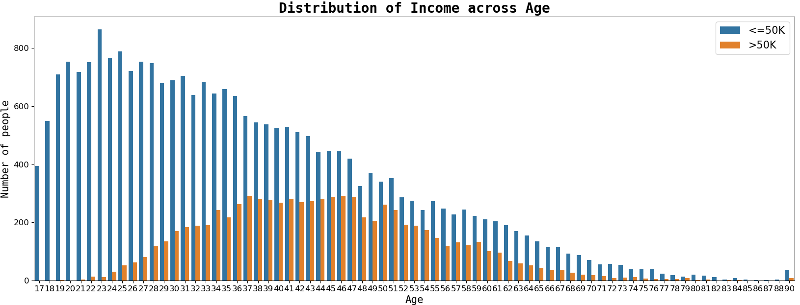

# Census-Income-Prediction
> Building a classification model for predicting the income using the Adult Census Income Dataset.

## Overview:
- In this notebook, we are going to predict whether a person's income is above 50k or below 50k using various features like age, education, and occupation.

> Read More about it in my [Blogpost](https://medium.com/@adityamankar09/tuning-random-forest-algorithm-to-predict-income-14005371656e)

## WebApp: 
> Link: https://census-income-prediction.herokuapp.com/
----

----

## Dataset:
| Column ID |   Column Name  | Data type | Values type |          Description         |
|:---------:|:--------------:|:---------:|:-----------:|:----------------------------:|
|     0     |       age      |   int64   |  Continous  |         Age of person        |
|     1     |    workclass   |   object  |   Discrete  |      Workclass of person     |
|     2     |     fnlwgt     |   int64   |  Continous  |         Final weight         |
|     3     |    education   |   object  |   Discrete  |  Education Degree of person  |
|     4     |  education.num |   int64   |  Continous  | Number of years of education |
|     5     | marital.status |   object  |   Discrete  |   Marital status of person   |
|     6     |   occupation   |   object  |   Discrete  |     Occupation of person     |
|     7     |  relationship  |   object  |   Discrete  |    Relationship of person    |
|     8     |      race      |   object  |   Discrete  |        Race of person        |
|     9     |       sex      |   object  |   Discrete  |         Sex of person        |
|     10    |  capital.gain  |   int64   |  Continous  |    Capital gain of person    |
|     11    |  capital.loss  |   int64   |  Continous  |    Capital loss of person    |
|     12    | hours.per.week |   int64   |  Continous  |   Number of hours per week   |
|     13    | native.country |   object  |   Discrete  |   Native country of person   |
|     14    |     income     |   object  |   Discrete  |   Income category of person  |

----

## Motivation:
- Building such predictive models can help us better understand the population of a country as well as the various factors affecting the growth in the economy.
- Governments can understand such factors and improve upon them leading to the growth of the country.

## Conclusion:
- In this project, we build various models like logistic regression, knn classifier, support vector classifier, decision tree classifier, random forest classifier and xgboost classifier.
- A hyperparameter tuned random forest classifier gives the highest accuracy score of 92.77 and f1 score of 93.08.

## Future Work:
- We have a large enough dataset, so we can use neural networks such as an artificial neural network to build a model which can result in better performance.
